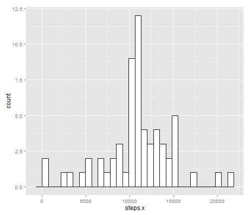

## Assignment 1

========================================================
You can read the assignment from repo:[Readme](./README.md)

### Loading and preprocessing the data:


```r
data <- read.csv(unzip("activity.zip"))
```

### What is mean total number of steps taken per day?:

To make data for plot and calculating mean we use aggregate function, aggregating data by date and using sum data

```r
sumSteps <- aggregate(steps~date,data,sum)
```

Build plot using ggplot2 library

```r
library(ggplot2) #load library before the first use
p<-ggplot(sumSteps, aes(x=steps))
p<-p+geom_histogram(binwidth=max(sumSteps$steps)/30, colour="black", fill="white")
```

Our plot:

```r
p
```

 

**Mean** number of steps:

```r
mean(sumSteps$steps)
```

```
## [1] 10766
```

**Median** number of steps:

```r
median(sumSteps$steps)
```

```
## [1] 10765
```

### What is the average daily activity pattern?

Again, using aggregate function we aggregate steps by interval.

```r
avgInterval <- aggregate(steps~interval, FUN=mean, data=data)
```

This time we are using geom_line to show time plot instead of distribution:

```r
p<-ggplot(avgInterval, aes(interval,steps))
p<-p+geom_line()
```

Plot:

```r
p
```

 

What was the most active interval?
we order our data with averaged intervals by numver of steps

```r
avgInterval[with(avgInterval,order(-steps))[1],c("interval")]
```

```
## [1] 835
```


### Imputing missing values task:

Calculate the number of rows with missing values:

```r
nrow(data[!complete.cases(data),])
```

```
## [1] 2304
```

Preparing data:
As a replacement of NA steps we use a averaged number of steps for the interval. We estimate that the mean and median wouldn't change significantly, due to the statistics laws.

We merge previously calculated avgInterval with original data by inteval column. Replace NA values with the values from averaged column.
Aggregate steps by date again.

```r
dataAvg <- merge(data,avgInterval,by="interval")
dataAvg[is.na(dataAvg$steps.x),c("steps.x")] <-dataAvg[is.na(dataAvg$steps.x),c("steps.y")]
sumStepsNA <- aggregate(steps.x~date,dataAvg,sum)
```

Here we use geom_histogram again for demonstrating the distribution

```r
p<-ggplot(sumStepsNA, aes(x=steps.x))
p<-p+geom_histogram(binwidth=max(sumSteps$steps)/30,colour="black", fill="white")
```

Plot:

```r
p
```

 

Mean of data without NA:

```r
mean(sumStepsNA$steps.x)
```

```
## [1] 10766
```

Median of data without NA:

```r
median(sumStepsNA$steps.x)
```

```
## [1] 10766
```

#### difference between deleting and not deleting NA

We measure it as a ratio between data including NA and not including NA

Mean ratio:

```r
mean(sumSteps$steps)/mean(sumStepsNA$steps.x)
```

```
## [1] 1
```

Median ratio:

```r
median(sumSteps$steps)/median(sumStepsNA$steps.x)
```

```
## [1] 0.9999
```

As we can see replacing NA values with averaged values doesn't impact the mean value at all, and only slightly the median.

### Differences in activity patterns between weekdays and weekends?

We **don't** use weekday() function not to get problems with non english locales.   
1. Instead we use %w to obtain digit value of the day of the week.   
2. We know that weekend days are saturday and sunday, they are 5 and 6 in numeric   
3. so every value higher than 4 means weekend   
4. we replace boolean by the value from character vector


```r
boolWeekname=c("Weekday","Weekend")
dataAvg$weekday<-as.numeric(as.numeric(format(as.Date(dataAvg$date),format="%w"))>4)+1
dataAvg$weekday<-boolWeekname[dataAvg$weekday]
avgIntervalWeekday <- aggregate(steps.x~interval+weekday, data=dataAvg, FUN=mean)
```

We use facet_grid to make plot

```r
p<-ggplot(avgIntervalWeekday, aes(interval,steps.x))
p<-p+geom_line()
p<-p+facet_grid(weekday~.)
```

Plot:

```r
p
```

 

